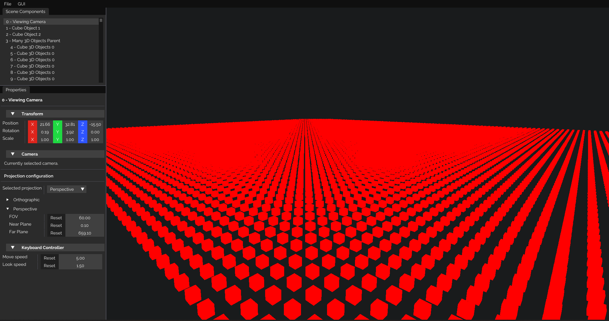

# WaterDropEngine


<br />



## Presentation
A 3D rendering engine mainly designed for computer graphics and physics simulations, using Vulkan.

The main goal of this library is to allow you to only focus on building the simulation or the animation, without worrying
about the technical program requirements (like handling drawing buffers, an update loop, directly drawing shapes in color, ...).

WaterDropEngine is a free and open-source project, so you can directly support it by submitting improvements and by creating
new pull requests or issues.
We'll be happy to answer your questions and to add your new code implementation ideas.


<br/>

## Getting Started
To start creating your own application, the easiest path is the following:

First, fork the project into your own GitHub account, clone the repository using `git clone https://github.com/mecanicascience/WaterDropEngine.git`,
and open a terminal window inside the `WaterDropEngine` cloned folder. Then run `git submodule init` and `git submodule update`
to install the engine required submodules.

Once all of these is done, you are ready to start using WaterDropEngine.

<br/>

## Examples
You will find the examples list on the [app/examples](app/examples) folder.

<br />

## Issues
If you encountered any issue, you can describe it under the [issues panel](https://github.com/mecanicascience/WaterDropEngine/issues).
You can also request new features there.

Please be polite, correct and precisely describe what your problem or suggestion is. Please also note that WaterDropEngine
is only maintained by volunteers, so please be tolerant about the possible answer delay.

<br/>

## How to contribute
If you want to help building WaterDropEngine, you can add new issues and post your suggestions here. To develop program with WaterDropEngine,
you'll first need to install the [Khronos Vulkan SDK](https://www.lunarg.com/vulkan-sdk/) made by LunarLG.

Once your are done modifying the engine, to commit your changes to GitHub, run:
```git
 > git add *
 > git commit -m "YOUR COMMIT MESSAGE"
 > git push
```

Once everything is ready, you should be able to submit your changes as a pull request (see the
[Github help documentation](https://help.github.com/en/github/collaborating-with-issues-and-pull-requests/creating-a-pull-request)
about this for more information).

<br />

## Credits
WaterDropEngine uses [Vulkan](https://www.vulkan.org/) and the [GLFW library](https://www.glfw.org/) to draw on the screen.
It also uses [GLM](https://github.com/g-truc/glm) to perform fast computations, and [tinyobjloader](https://github.com/tinyobjloader/tinyobjloader) to load objects. 
The GUI is drawn using [Dear ImGUI](https://github.com/ocornut/imgui).
The WaterDropEngine rendering structure was highly based on the [Vulkan tutorial](https://vulkan-tutorial.com), and the [Vulkan guide](https://vkguide.dev/).

WaterDropEngine was created and is currently maintained by [Mecanica Science](https://mecanicascience.fr/).
You can find further information and library credits down below.
- If you want to use WaterDropEngine, you need to follow the [license requirements](https://github.com/mecanicascience/WaterDropEngine/blob/master/LICENSE) (to sum up, you can use pSEngine everywhere and for any purpose, as long as there is a copyright notice).
- You can find all WaterDropEngine versions on [this link](https://github.com/mecanicascience/WaterDropEngine/releases).
- WaterDropEngine uses [Vulkan](https://www.vulkan.org/), [GLFW](https://www.glfw.org/), [GLM](https://github.com/g-truc/glm),
[tinyobjloader](https://github.com/tinyobjloader/tinyobjloader) and [Dear ImGUI](https://github.com/ocornut/imgui).

<br />
