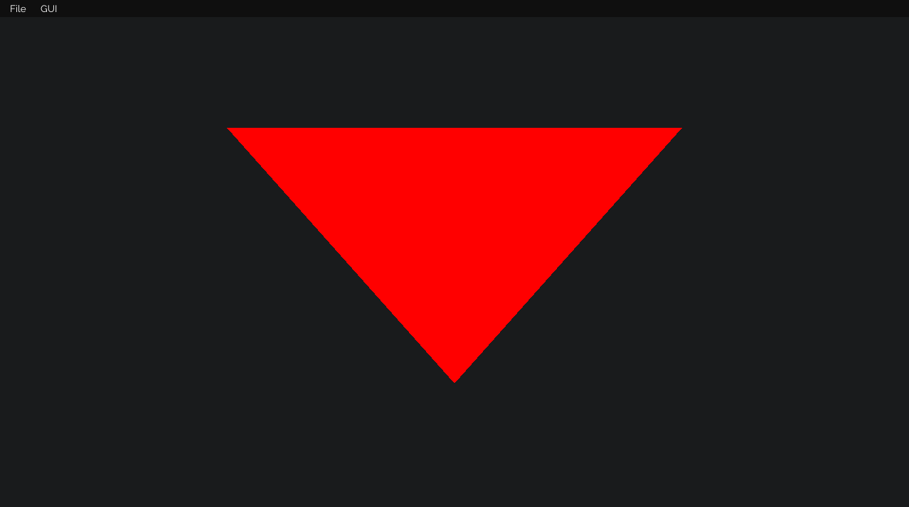
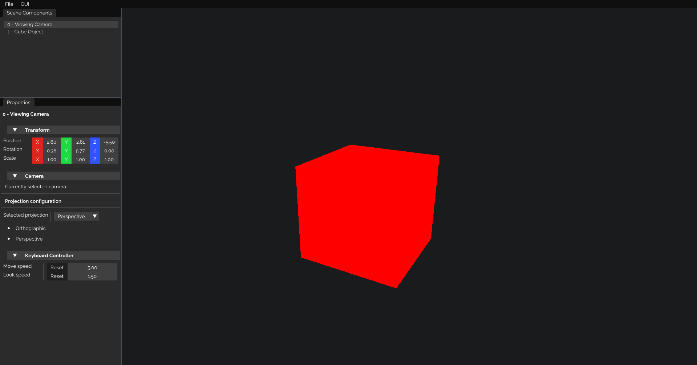

# WaterDropEngine Examples
WaterDropEngine comes with multiple engine examples. To run an example, first go to the `app/main.cpp` folder
and de-comment you want to execute.

Here below is a list and image of each examples and their results.

 

## 01 - A simple triangle drawn to the screen.

## 02 - A 3D cube drawn, and you can move around with your keyboard

## 03 - Draw the objects as instanced

