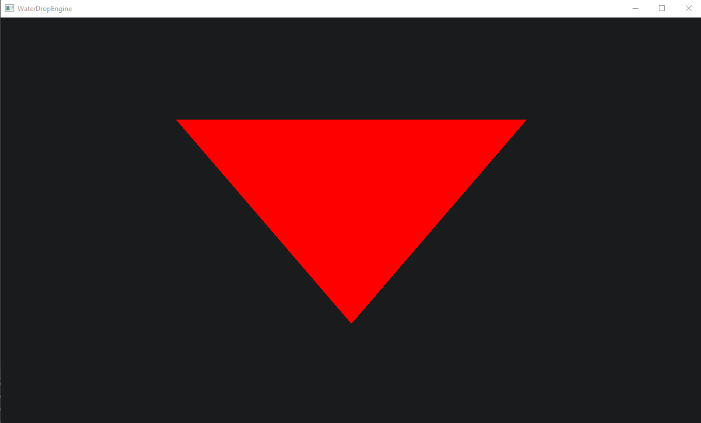
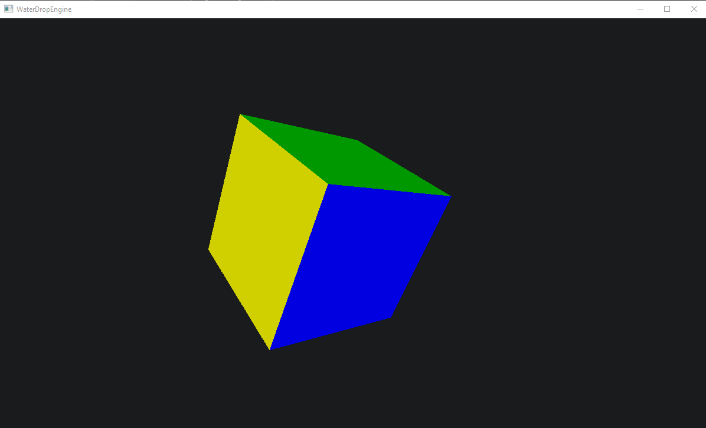
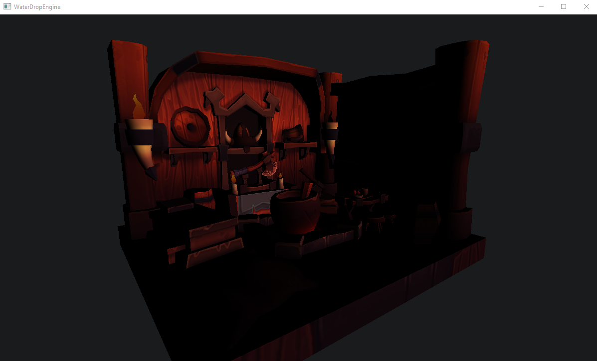
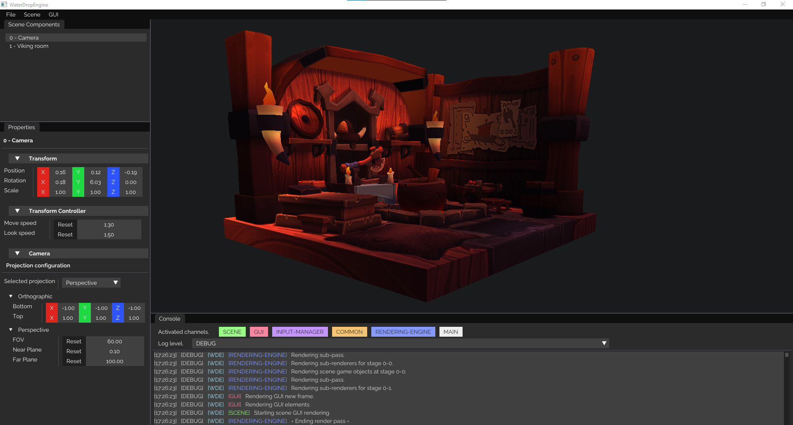
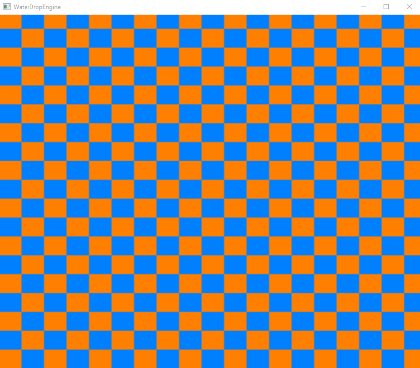
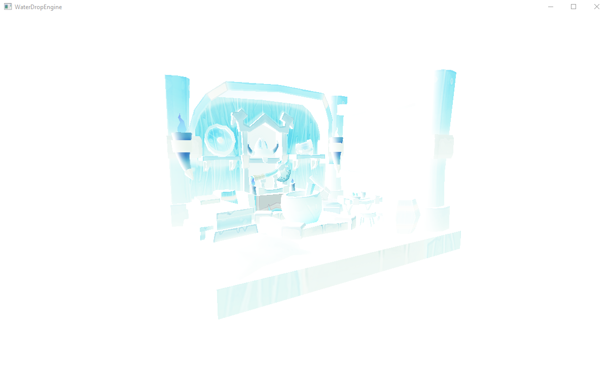

# WaterDropEngine Examples
WaterDropEngine comes with multiple engine examples. To run an example, first go to the `app/main.cpp` folder and make sure
that you only use the `ExamplesApp` class as your engine instance.  

Then, go to the `app/examples/ExamplesApp.cpp` file, and uncomment the example that you wish to see. Please note that you can
only see one example at a time. Here are some basic examples that you can create pretty easily.  

Here below is a list and image of each example and their results.

 

## 01 - A simple triangle drawn to the screen.

## 02 - A 3D cube drawn, and you can move around with your keyboard

## 03 - Loads an object and it's texture from and `.obj` file

## 04 - Draw GUI elements to the window

## 05 - Run a simple compute shader that generate an image, and displays it to the screen

## 06 - A simple post-processing filter that invert colors
